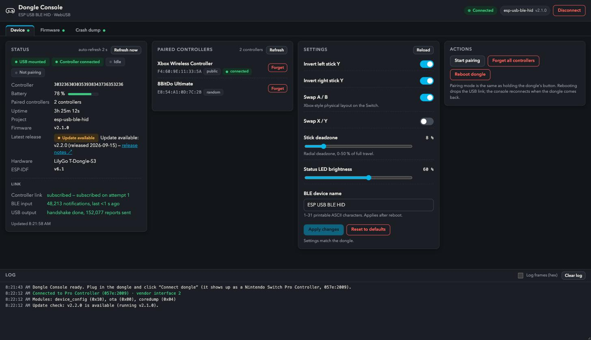
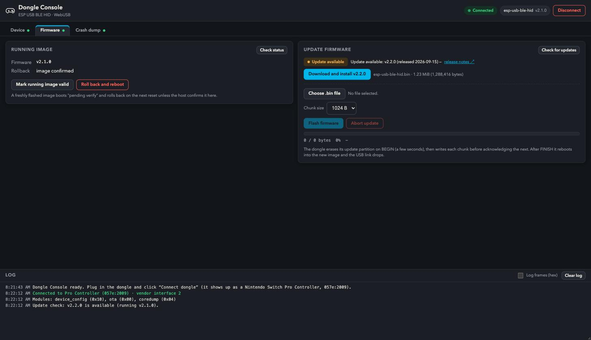
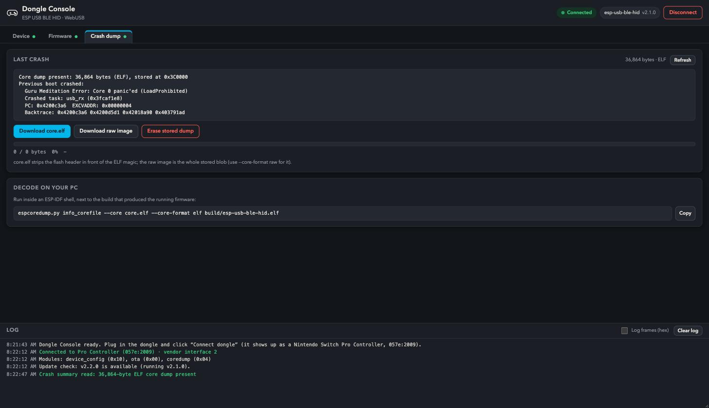

<h1 align="center">ESP USB BLE HID</h1>

<p align="center">
  <strong>Use your Xbox Wireless Controller on a Nintendo Switch — through a tiny USB dongle.</strong><br>
  Bluetooth LE in, Switch Pro Controller out. No drivers, no app, no soldering.
</p>

<p align="center">
  <a href="https://github.com/finger563/esp-usb-ble-hid/releases/latest"></a>
  <a href="https://github.com/finger563/esp-usb-ble-hid/actions/workflows/build.yml"></a>
  <a href="https://github.com/finger563/esp-usb-ble-hid/actions/workflows/static_analysis.yml"></a>
  <a href="https://finger563.github.io/esp-usb-ble-hid/dongle_console.html"></a>
  <a href="LICENSE"></a>
</p>

<p align="center">
  
</p>

The dongle is an ESP32-S3 board running this firmware. It pairs with your
controller over Bluetooth LE and shows up to the Switch as a wired **Pro
Controller**, so the Switch never has to know it is talking to an Xbox
controller. It remembers up to five controllers, reconnects on its own, and
carries its own browser-based settings page, firmware updater and crash
reporter over the same USB plug.

Because it presents as a standard Pro Controller, it also works on a PC, Mac,
Android or iOS device that understands one.

## Quick start

| | Step | |
|---|---|---|
| **1** | **Get a dongle.** A [LilyGo T-Dongle-S3](https://lilygo.cc/products/t-dongle-s3) ([Amazon](https://www.amazon.com/LILYGO-T-Dongle-S3-ESP32-S3-Development-Display/dp/B0BK9162QY)) is the recommended board: it has a tiny screen that shows the link status. An [Adafruit QT Py ESP32-S3](https://www.adafruit.com/product/5426) works too. | |
| **2** | **Program it once.** Plug the dongle into your computer and run the *programmer* from the [latest release](https://github.com/finger563/esp-usb-ble-hid/releases/latest) — a single executable for Windows, macOS or Linux; no toolchain needed. | `esp-usb-ble-hid_programmer_<version>_<os>` |
| **3** | **Enable wired controllers on the Switch.** *System Settings → Controllers and Sensors → Pro Controller Wired Communication → On.* | |
| **4** | **Plug it into the dock and pair.** Hold the dongle's button for 3 s until the LED pulses blue, then put your controller in pairing mode. From then on it reconnects by itself every time. | |

Later firmware updates never need the programmer again: the
[Dongle Console](#the-dongle-console) installs them straight from GitHub
over USB.

### See it in action

https://github.com/user-attachments/assets/a0789d38-bd0e-4215-bf2c-ebedd9958495

https://github.com/user-attachments/assets/c81b947a-24a1-4a44-b5d0-5d4c274beb93

## What you get

- **Xbox → Switch, live.** Every button, both sticks and the triggers are
  translated into Pro Controller reports at the Switch's polling rate.
  Stick inversion, A/B and X/Y swaps and a radial deadzone are configurable.
- **Set-and-forget pairing.** Up to five bonded controllers; the dongle
  reconnects to whichever one comes back, and drops every input the instant a
  controller goes away so nothing stays "pressed".
- **A console in your browser.** Status, paired controllers, settings and
  actions over WebUSB — from the hosted page or a local copy, no install.
- **Firmware updates over USB.** The console checks GitHub Releases, tells
  you when a newer firmware exists and installs it in place, with automatic
  rollback if the new image never confirms itself.
- **Crash dumps you can actually read.** If the firmware ever panics, the
  core dump is kept in flash; the console shows a summary and downloads the
  ELF for `espcoredump.py`.
- **Status you can see.** The T-Dongle-S3's screen shows USB / Bluetooth
  state and the connected controller's serial; the RGB LED breathes while
  scanning and flickers with traffic.

## Everyday use

| Dongle | Meaning | What to do |
|---|---|---|
| LED pulsing blue, fast (1 s) | **Pairing** — will bond with the first BLE gamepad it finds | Put the controller in pairing mode |
| LED pulsing blue, slow (3 s) | **Reconnecting** — looking for a remembered controller | Turn the controller on |
| LED off, flickering with input | **Connected** — inputs are flowing to the Switch | Play |
| Hold the button 3 s | Enter pairing mode (also available from the console) | |

A few things worth knowing:

- **The Switch cuts USB power when it sleeps**, so the dongle cannot wake the
  console; press a button on a Joy-Con or use the dock's own controls. (A
  USB-to-Ethernet adapter in the dock reportedly keeps the port awake.)
- **No bonded controller?** The dongle starts in pairing mode by itself.
- **Forgot which controllers are paired?** The console lists them by name.

## The Dongle Console

Plug the dongle into a computer, open
**[finger563.github.io/esp-usb-ble-hid/dongle_console.html](https://finger563.github.io/esp-usb-ble-hid/dongle_console.html)**
in a Chromium-based browser (Chrome, Edge, Brave; it uses WebUSB) and click
*Connect dongle*. The page is a single self-contained HTML file —
[`web/dongle_console.html`](web/dongle_console.html) works from a local copy
too. Its only network access is the optional release check.

### Device



- **Status** — USB / controller / scanning / pairing badges, the connected
  controller's serial and battery, uptime, firmware, hardware and ESP-IDF
  version, and whether a newer release exists. Refreshes every 2 s.
- **Link** — where the BLE bring-up is (scanning → connecting → encrypting →
  subscribing → subscribed) with the dongle's own note on the last link
  event, how many input notifications the controller has sent, and whether
  the Switch has finished the Pro Controller handshake. This is the first
  place to look for "connected but nothing happens".
- **Paired controllers** — every bond by the name the controller reports
  (learned when it connects), with its address and a per-row *Forget*.
- **Settings** (stored in flash, survive updates) — invert left / right
  stick Y, swap A/B, swap X/Y, stick deadzone (0–50 %), LED brightness, BLE
  device name.
- **Actions** — start pairing, forget all controllers, reboot.

### Firmware



The tab compares the running firmware with the latest GitHub release and
offers **Download and install** — or flashes a `.bin` you built yourself.
The dongle has two app slots: a fresh image boots in *pending-verify* state
and the console asks you to confirm it after the reboot; an unconfirmed image
is rolled back by the bootloader on the next reset.

> Dongles running v2.1.0 or older have the previous (single-app) partition
> layout and need the programmer one more time; after that every update goes
> over USB.

### Crash dump



If the firmware panics, the core dump lands in a dedicated partition and the
next boot logs a summary. The tab shows it, downloads `core.elf` (decode with
`espcoredump.py info_corefile --core core.elf --core-format elf build/esp-usb-ble-hid.elf`)
and can erase it. Please attach it to a bug report.

*(The screenshots above are staged with sample data; the layout is the real
console.)*

## Supported hardware and controllers

| | Supported | Notes |
|---|---|---|
| **Boards** | LilyGo T-Dongle-S3, Adafruit QT Py ESP32-S3 | Select under *Hardware Configuration* in `menuconfig`; the release binaries target the T-Dongle-S3 |
| **Controllers** | Xbox Wireless Controller (Bluetooth LE models: Xbox Series X\|S controller, Xbox One controllers with the BLE firmware update) | Any BLE gamepad can pair, but its reports are decoded with the Xbox layout — other layouts are a small parser away (`components/xbox`) |
| **Hosts** | Nintendo Switch (docked or via a USB-C adapter), plus anything that accepts a USB Pro Controller: Windows, macOS, Linux, Android, iOS | The Switch needs *Pro Controller Wired Communication* enabled |

## Building from source

The project builds with **ESP-IDF v6.1**. Every library comes from the
[ESP Component Registry](https://components.espressif.com) — the
[espp](https://github.com/esp-cpp/espp) components, `esp_tinyusb`,
`esp-nimble-cpp` — and is fetched on the first build.

```sh
git clone https://github.com/finger563/esp-usb-ble-hid
cd esp-usb-ble-hid
idf.py menuconfig          # Hardware Configuration → Target Hardware; USB Configuration
idf.py -p PORT flash monitor
```

`USB Configuration` controls the interfaces next to the Pro Controller HID
interface: the **vendor (WebUSB) interface** for the console (default on;
turn it off for a plain single-interface gamepad) and an optional
**CDC-ACM log console** so `idf.py monitor` works over the same cable.

Once a dongle runs this firmware you can update it without a serial port:

```sh
ESPP_OTA_VID=0x057E ESPP_OTA_PID=0x2009 idf.py ota-usb   # after idf.py build
```

## Under the hood

```
BLE gamepad ──notify──▶ Xbox report parser ──▶ GamepadInputs ──settings──▶ espp::SwitchPro
                                                                                │ input report
                                                            espp::UsbDevice ◀───┘
                                                        ┌────────┴──────────────────┐
                                           HID iface (Pro Controller)     vendor iface (WebUSB)
                                                   │                              │
                                            Nintendo Switch              espp::Dispatcher
                                                                      ┌──────┼──────────┐
                                                                   OTA   Core Dump   Device Config
```

| Piece | Where | What it does |
|---|---|---|
| BLE central | `main/ble.cpp` | Scanning, pairing, bonding, HID subscription, and a 100 ms supervisor that owns the LED, encryption retries and reconnects |
| USB device | `main/usb.cpp` | Composite device (HID + vendor + optional CDC), Pro Controller handshake and report sender, vendor RX worker |
| Services | `main/services.cpp` | Settings in NVS, and the OTA / core-dump / device-config modules on the dispatcher |
| Device config | `components/device_config` | The console's protocol (module `0x10`) and module class, with host-side tests |
| Controller parsing | `components/xbox`, `components/gamepad_inputs` | Xbox report layout → generic gamepad inputs |
| Display | `components/gui` | The T-Dongle-S3 status screen (SquareLine / LVGL) |
| Console | `web/dongle_console.html` | The browser UI, published to GitHub Pages by `publish_webapp.yml` |

The console stream is the espp `stream_frame` + `dispatcher` pair, so the
dongle is also a ready-made example of a device with a browser console:

| Module | Id | Provided by |
|---|---|---|
| OTA | `0x00` | `espp/ota` |
| Core dump | `0x04` | `espp/coredump` |
| Device config | `0x10` | this repo |

Adding a module of your own means one protocol header, one class and one
tab: `components/device_config` is a complete, host-tested example, and the
espp [custom modules guide](https://esp-cpp.github.io/espp/dispatcher/custom_modules.html)
walks through the contract.

## Troubleshooting

- **Controller connected, nothing happens on the Switch** — open the
  console's *Link* block. A silent BLE side (no notifications) is the
  controller: press a button or power-cycle it. A silent USB side means the
  Switch has not finished the handshake: check *Pro Controller Wired
  Communication*, then re-plug the dongle.
- **Controller keeps connecting and dropping** — the *Controller link* row
  says which step fails and why (e.g. encryption). Forgetting the controller
  on both sides and pairing again clears a stale bond.
- **The Switch does not see a controller at all** — the dongle only mounts
  while the Switch is awake; wake it first.
- **Something crashed** — the *Crash dump* tab has the summary. Please open
  an issue with `core.elf` attached.

## Credits and references

Built on [espp](https://github.com/esp-cpp/espp) (`switch_pro`, `usb_device`,
`ota`, `coredump`, `dispatcher`, `hid-rp`, BSPs) and
[esp-nimble-cpp](https://github.com/h2zero/esp-nimble-cpp). The Pro Controller
implementation owes a great deal to the community's reverse-engineering work:

- [dekuNukem/Nintendo_Switch_Reverse_Engineering](https://github.com/dekuNukem/Nintendo_Switch_Reverse_Engineering) — [USB HID notes](https://github.com/dekuNukem/Nintendo_Switch_Reverse_Engineering/blob/master/USB-HID-Notes.md), [subcommands](https://github.com/dekuNukem/Nintendo_Switch_Reverse_Engineering/blob/master/bluetooth_hid_subcommands_notes.md), [SPI flash](https://github.com/dekuNukem/Nintendo_Switch_Reverse_Engineering/blob/master/spi_flash_notes.md)
- [Brikwerk/nxbt](https://github.com/Brikwerk/nxbt/blob/master/nxbt/controller/protocol.py)
- [mzyy94/nscon](https://github.com/mzyy94/nscon/blob/master/nscon.go) and the [USB gadget write-up](https://www.mzyy94.com/blog/2020/03/20/nintendo-switch-pro-controller-usb-gadget/)
- [EasyConNS/BlueCon-esp32](https://github.com/EasyConNS/BlueCon-esp32/tree/master/components/joycon)

Licensed under the [MIT License](LICENSE).
